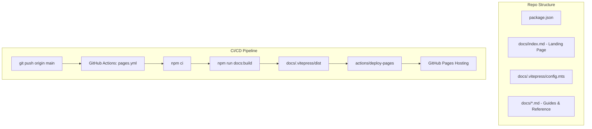

# Technical Design: GitHub Pages Informative Landing Site

## Architecture Overview
The documentation landing site is powered by **VitePress**, a modern, fast Static Site Generator built on Vite and Vue 3. It utilizes markdown-first authoring, generates pre-rendered static HTML/CSS/JS assets, and requires zero client-side framework bloat for initial page load.

The repository root houses `package.json` with documentation scripts (`docs:dev`, `docs:build`, `docs:preview`). Documentation source files reside in `docs/` and VitePress configuration resides in `docs/.vitepress/config.mts`.

Deployment is fully automated using GitHub Actions (`.github/workflows/pages.yml`), utilizing the official `actions/configure-pages`, `actions/upload-pages-artifact`, and `actions/deploy-pages` actions.



## Directory Layout
```text
cooper/
├── .github/
│   └── workflows/
│       └── pages.yml                # Automated GitHub Pages build & deployment
├── docs/
│   ├── .vitepress/
│   │   └── config.mts               # VitePress site configuration (nav, sidebar, theme)
│   ├── public/                      # Static assets, logos, and icons
│   ├── index.md                     # Landing page with VitePress home layout
│   ├── guide/
│   │   ├── getting-started.md       # Quickstart guide
│   │   └── workflow.md              # Cooper SDD + Troop isolation workflow
│   ├── INSTALL.md                   # Existing install guide
│   ├── openspec-vs-conductor-comparison.md
│   └── rfc-draft-prs.md
└── package.json                     # VitePress devDependency & doc scripts
```

## Configuration & Theme Specifications
1. **Base URL**: Set dynamically or default to `/cooper/` to support standard GitHub repository Pages URLs (`https://twoBoots.github.io/cooper/`).
2. **Branding & Navigation**:
   - Title: `Cooper`
   - Description: `Spec-Driven Development (SDD) & Troop Worktree Isolation Framework`
   - Navbar:
     - `Guide`: Getting Started, Workflow
     - `Installation`: Link to Installation Guide
     - `GitHub`: External link to `https://github.com/twoBoots/cooper`
   - Social Links:
     - GitHub: `https://github.com/twoBoots/cooper`
3. **Hero Layout (`docs/index.md`)**:
   - Layout: `home`
   - Hero:
     - Name: `Cooper`
     - Text: `Spec-Driven Development for Resilient Agentic Engineering`
     - Tagline: `Eliminate hallucinated drift with living specs, Git Notes, and isolated Troop worktrees.`
     - Actions:
       - Text: `Get Started` (Theme: `brand`, Link: `/guide/getting-started`)
       - Text: `View on GitHub` (Theme: `alt`, Link: `https://github.com/twoBoots/cooper`)
   - Features Grid:
     - Feature 1: `Living Capability Specs` (Grounded requirements in `.cooper/specs/`)
     - Feature 2: `[Troop](https://github.com/twoBoots/troop) Isolation` (Strict worktree isolation per track)
     - Feature 3: `TDD-Enforced Planning` (Strict Red-Green-Refactor phase gates)
     - Feature 4: `Multi-Platform Go CLI` (Native high-performance CLI and MCP tooling)

## GitHub Actions Deployment Workflow (`.github/workflows/pages.yml`)
- Trigger: `push` to `main` branch (filtering paths `docs/**`, `package*.json`, `.github/workflows/pages.yml`), and `workflow_dispatch`.
- Permissions:
  - `contents: read`
  - `pages: write`
  - `id-token: write`
- Concurrency: Group `pages` with `cancel-in-progress: false`.
- Steps:
  1. Checkout repository.
  2. Setup Node.js (Node 20+ LTS).
  3. Setup Pages (`actions/configure-pages@v5`).
  4. Install dependencies (`npm ci`).
  5. Build site (`npm run docs:build`).
  6. Upload artifact pointing to `docs/.vitepress/dist` (`actions/upload-pages-artifact@v3`).
  7. Deploy to GitHub Pages (`actions/deploy-pages@v4`).

## Testing & Quality Control Strategy
1. **Build Validation**: Automated npm script `npm run docs:build` verifies that all markdown syntax, internal links, and assets compile without broken references.
2. **Link & Attribution Check**: Automated test or script checking that all mentions of Troop in documentation link to `https://github.com/twoBoots/troop`.
3. **Format & Lint**: Prettier/linter check for markdown and configuration files.
