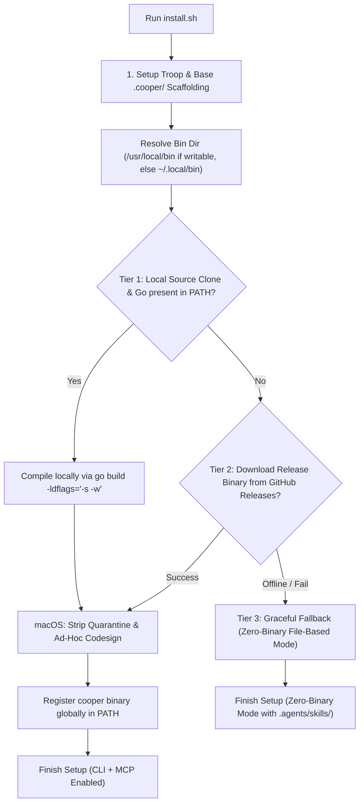

# RFC: Cooper Go CLI & MCP Server Architecture

- **RFC ID**: `rfc-cooper-cli-mcp`
- **Author**: System Architect & Cooper AI
- **Status**: In Review (Draft)
- **Created**: 2026-08-20T20:16:30+10:00

---

## 1. Executive Summary & Motivation

### Problem Statement
Currently, **Cooper** is distributed as a pure shell script (`install.sh`) and a collection of markdown templates and agent skills. While this zero-dependency, file-only model makes initial onboarding lightweight, it introduces key operational challenges as projects evolve:
1. **No Safe Upstream Upgrades**: When Cooper releases improvements to agent skills, workflow governance, or templates, target repositories cannot easily update without either manually copying files or running `install.sh` (which risks overwriting project customizations).
2. **Agent Friction in File Manipulation**: AI coding agents must perform multi-step regex, file formatting, and command juggling to scaffold tracks, create spec deltas, and attach Git Notes.
3. **Absence of Strict Validation**: There is no fast, deterministic validation mechanism for Living Spec syntax (`GIVEN`/`WHEN`/`THEN`), track metadata integrity, or broken documentation references.

### Proposed Solution
Develop a high-performance, standalone **Go CLI (`cooper`)** with an embedded **Model Context Protocol (MCP) server** (`cooper mcp`):
- **Core CLI Commands**: Fast, offline-first commands for initialization (`cooper init`), track orchestration (`cooper track [new|status|checkpoint|close]`), SDD validation (`cooper validate`), and upstream synchronization (`cooper update`).
- **Agent-Guided MCP Upgrades**: Expose structured MCP tools (`cooper_check_updates`, `cooper_diff_updates`, `cooper_apply_update`) allowing AI coding agents to inspect upstream changes, present 3-way diffs in chat, and guide users through merging updates while preserving project customizations.
- **Progressive Enhancement in `install.sh`**: `install.sh` offers pre-built binary downloads from GitHub Releases with automatic OS/arch detection, while cleanly preserving a 100% zero-binary fallback for environments that only want markdown files and skills.

---

## 2. Architecture & Detailed Design

### 2.1 Ecosystem Synergy & Boundary Map

```
┌─────────────────────────────────────────────────────────────┐
│                       twoBoots/battery                      │
│   (Barrel & tech-stack generator, template & MCP manager)   │
└──────────────────────────────┬──────────────────────────────┘
                               │ installs / consumes
                               ▼
┌─────────────────────────────────────────────────────────────┐
│                       twoBoots/cooper                       │
│    (Spec-Driven Development, Living Specs, Track Lifecycle) │
│                                                             │
│   • cooper CLI (Go binary: validation, 3-way update, MCP)   │
│   • .cooper/ & .agents/skills/ (Universal SDD workspace)    │
└──────────────────────────────┬──────────────────────────────┘
                               │ isolates work
                               ▼
┌─────────────────────────────────────────────────────────────┐
│                        twoBoots/troop                       │
│       (Git worktree isolation: agent-start, agent-stop)     │
└─────────────────────────────────────────────────────────────┘
```

### 2.2 Go CLI Repository Layout & Modular Architecture

```
cooper/
├── cmd/
│   └── cooper/
│       └── main.go                    # Cobra entrypoint
├── internal/
│   ├── cli/                           # Command definitions (init, track, validate, update, mcp)
│   │   ├── init.go
│   │   ├── track.go
│   │   ├── validate.go
│   │   ├── update.go
│   │   └── mcp.go
│   ├── mcp/                           # Embedded MCP Server (JSON-RPC over stdio)
│   │   ├── server.go
│   │   ├── tools_track.go
│   │   ├── tools_specs.go
│   │   └── tools_update.go
│   ├── updater/                       # Upstream sync & 3-way diff reconciliation engine
│   │   ├── fetcher.go
│   │   ├── manifest.go
│   │   └── diff3.go
│   ├── validator/                     # GIVEN/WHEN/THEN linter, schema & link checker
│   │   ├── spec_linter.go
│   │   └── metadata_checker.go
│   └── track/                         # Track & Troop worktree orchestration
│       ├── worktree.go
│       └── checkpoint.go
├── install.sh                         # Enhanced installer with optional binary download
├── templates/                         # Packaged templates & embedded filesystem (go:embed)
├── skills/                            # Packaged agent skills
└── go.mod
```

---

## 3. Core Capabilities & Workflows

### 3.1 Upstream Synchronization & Agent-Guided MCP Updates

Cooper projects record an upstream release manifest at `.cooper/manifest.json`:
```json
{
  "version": "1.2.0",
  "upstream_commit": "a1b2c3d4",
  "files": {
    ".agents/skills/cooper-implement/SKILL.md": "sha256-hash...",
    ".cooper/definition/workflow.md": "sha256-hash..."
  }
}
```

When an update is checked via CLI (`cooper update`) or MCP (`cooper_check_updates`):
1. **Fetch Latest Upstream**: Retrieves latest release manifest and assets from GitHub.
2. **Compute 3-Way Diff**:
   - `Base`: Original upstream template when project was initialized.
   - `Local`: Target repository's modified file (with user customizations).
   - `Remote`: Newly released upstream template.
3. **Agent-Guided MCP Flow**:
   - AI agent calls `cooper_diff_updates` to inspect non-conflicting enhancements and conflicting customizations.
   - The agent explains incoming upstream improvements in conversation (e.g., *"Upstream updated `cooper-implement` with INP audit checks. You added a custom security scanner on line 42. I will merge both safely."*).
   - Agent calls `cooper_apply_update` with chosen merge resolutions, updating `.cooper/manifest.json`.

---

### 3.2 Embedded Model Context Protocol (MCP) Server

Running `cooper mcp` starts a standard JSON-RPC server over `stdio`, exposing:

| MCP Tool | Description |
| :--- | :--- |
| **`cooper_init_project`** | Scaffolds or migrates project context into `.cooper/`. |
| **`cooper_track_create`** | Spawns Troop worktree, initializes `proposal.md`, `design.md`, `metadata.json`, and registers in `tracks.md`. |
| **`cooper_spec_delta_validate`**| Validates syntax and consistency of `spec-deltas/<cap>/spec.md`. |
| **`cooper_checkpoint_record`** | Records verification metadata, attaches `git notes`, updates `plan.md`, and syncs remote. |
| **`cooper_check_updates`** | Checks upstream release channel for new skills, rules, or template versions. |
| **`cooper_diff_updates`** | Computes 3-way diffs between upstream release and local customized files. |
| **`cooper_apply_update`** | Applies upstream updates with custom preservation rules. |

---

### 3.3 Tiered CLI Installation & Fallback Lifecycle (`install.sh`)

Matching the proven architecture of `twoBoots/battery`, Cooper's `install.sh` uses a **3-Tiered Registration Strategy** with automatic fallback and zero-prompt execution:



#### Tier Breakdown:
1. **Target Directory Resolution**: Automatically prefers `/usr/local/bin` if writable, otherwise falls back to `${HOME}/.local/bin` (creating directory if missing).
2. **Tier 1 (Local Compilation)**: If `install.sh` executes from a local clone with `main.go` and `go` is found in `$PATH`, it compiles the binary immediately: `go build -ldflags="-s -w" -o <bin_dir>/cooper .`.
3. **Tier 2 (Pre-built Release Download)**: Detects OS (`darwin`/`linux`) and architecture (`x86_64`/`aarch64`/`arm64`) and fetches `https://github.com/twoBoots/cooper/releases/latest/download/cooper-${OS}-${ARCH}` via `curl` or `wget`.
4. **macOS Gatekeeper Integration**: Automatically applies `xattr -d com.apple.quarantine` and `codesign -s - --force` to downloaded/compiled binaries on Darwin.
5. **Tier 3 (Zero-Binary Fallback)**: If both Tier 1 and Tier 2 fail (air-gapped environments or GitHub API rate limits), the installer completes gracefully in zero-binary mode (`.cooper/` and `.agents/skills/` only) without throwing fatal errors.

---

## 4. Alternatives Considered

1. **Python CLI**: Higher maintenance footprint due to Python runtime environments, virtual environments (`venv`/`pipx`), and dependency conflicts on developer machines.
2. **Node.js / npm Package (`npx cooper-sdd`)**: Easy for JavaScript developers, but introduces Node runtime dependency on pure Go, Rust, or Python projects.
3. **Go (Selected Approach)**: Single static binary, zero runtime dependencies, cross-compilation for all platforms, directly aligns with `twoBoots/battery` conventions and fast CLI execution.

---

## 5. Security, Performance & Scalability

- **Zero Network Drift**: CLI operations default to local file validation; network access is strictly confined to `cooper update` and release checks.
- **Fast Execution**: Written in Go with minimal startup latency (<10ms for `cooper validate` / `cooper track status`).
- **Memory Footprint**: Low overhead (<15MB RAM for MCP server lifecycle).

---

## 6. Open Questions & Discussion Topics

1. **Release Distribution**: Should GitHub Actions compile multi-architecture binaries and attach them as GitHub Release artifacts on version tags (`v*.*.*`)?
2. **Default CLI Install Path**: Should `install.sh` prefer `~/.local/bin` (non-sudo) or prompt for `/usr/local/bin` if writable?
3. **MCP Config Registration**: Should `cooper init` offer to auto-write MCP registration snippets for Cursor (`.cursor/mcp.json`), Claude Desktop (`claude_desktop_config.json`), and Antigravity IDE?
