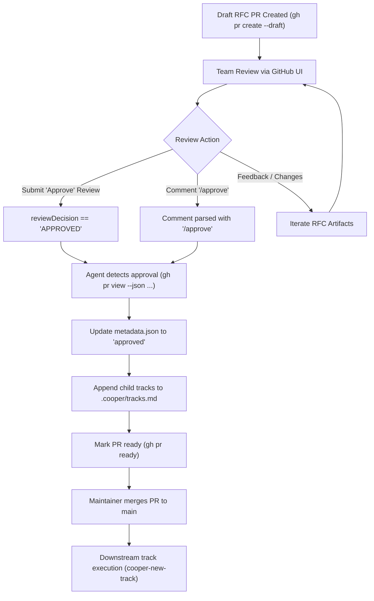

# Technical Design: RFC PR Approval Detection & Reviewer Instructions

## 1. Architecture Overview
This enhancement aligns `cooper-rfc` skill instructions, PR scaffolding templates, and framework documentation with an automated PR approval detection protocol.



## 2. Component Changes

### 2.1 `skills/cooper-rfc/SKILL.md` and `.agents/skills/cooper-rfc/SKILL.md`
- **Step 5.3 (Open Draft Pull Request)**: Add a structured reviewer guidance block in `prbody.md`:
  ```markdown
  ### Reviewer Actions
  - **Feedback**: Leave line comments or general comments on open questions and architecture trade-offs.
  - **Approve**: Submit a standard GitHub review approval (`Approve`) or comment `/approve` once architecture and living spec deltas are aligned.
  - **Graduation**: Approval triggers track registration in `.cooper/tracks.md` and transitions the PR to Ready for Merge.
  ```
- **Step 6.1 / 6.2 (Review Comments Synthesis & Approval Detection)**:
  - Add explicit detection command:
    ```bash
    gh pr view --json state,reviews,reviewDecision --jq '{state: .state, decision: .reviewDecision, approvals: [.reviews[] | select(.state=="APPROVED") | .author.login]}'
    ```
  - Parse comments for `/approve` or maintainer sign-off triggers:
    ```bash
    gh pr view --comments
    ```
  - Automatically transition to Step 6.2 (Approval, Track Registration & User Merge Gate) upon detecting approval.

### 2.2 `.cooper/COOPER.md`
- Update Section *## Planning Architecture: The Two-Tier Model* (and *Upstream Alignment (`cooper-rfc`)*) to document:
  1. RFC Draft PR creation with reviewer guidance.
  2. Team review via GitHub Native Review (`Approve`) or `/approve` comments.
  3. AI detection of PR approval and track registration in `.cooper/tracks.md`.
  4. PR marked ready for review (`gh pr ready`).
  5. Mandatory human maintainer merge to `main`.
  6. Downstream track execution in isolated [Troop](https://github.com/twoBoots/troop) worktrees (`cooper-new-track`).

### 2.3 `.cooper/definition/workflow.md`
- Clarify Principle 9 (*Upstream Architecture vs. Track Execution*) to note the RFC-to-Track boundary and registration handoff.

### 2.4 Living Spec & Spec Delta
- Establish living capability spec `.cooper/specs/cooper-rfc/spec.md`.
- Produce track spec delta `.cooper/active/rfc-pr-approval-protocols/spec-deltas/cooper-rfc/spec.md`.
