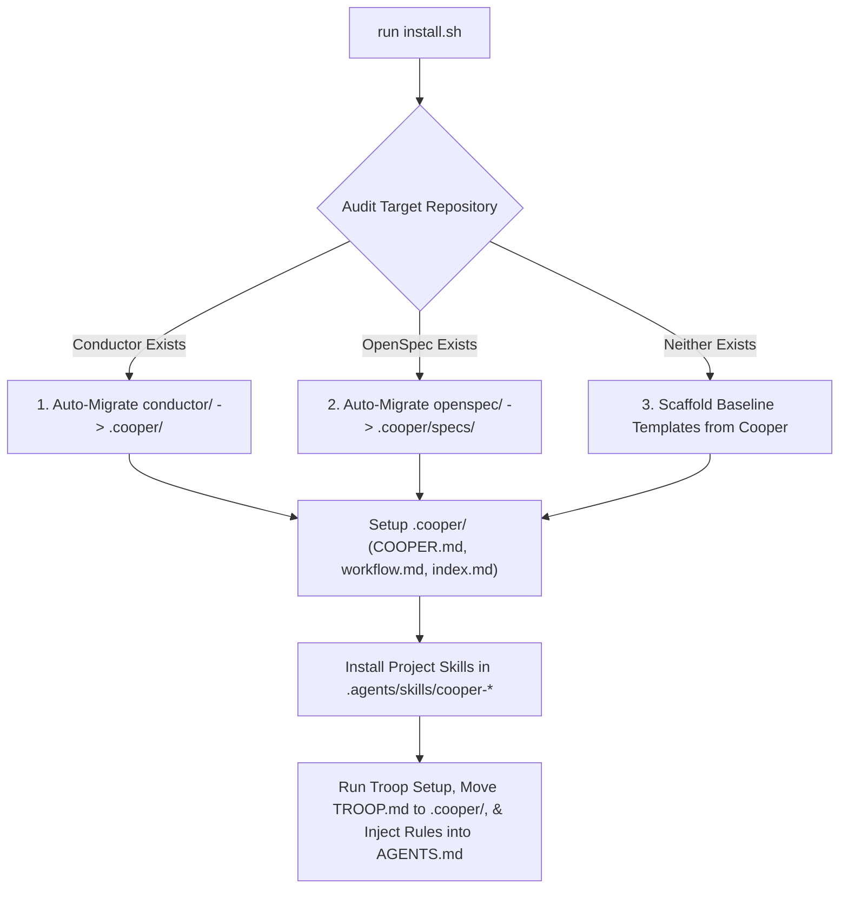

# Cooper Installation & Migration Guide

`install.sh` is a one-line installer that scaffolds the **Cooper Spec-Driven Development (SDD) Framework** (`.cooper/`), **[Troop](https://github.com/twoBoots/troop) Worktree Isolation** (`.worktrees/`), and native **Project Agent Skills** (`.agents/skills/`) into any target Git repository.

---

## Quick Installation

Run the following command inside your target repository:

```bash
curl -fsSL https://raw.githubusercontent.com/twoBoots/cooper/main/install.sh | bash
```

Alternatively, if running from a local clone of the Cooper repository:

```bash
/path/to/cooper/install.sh /path/to/your-project
```

---

## Installer Execution Flow & Migration Logic



### 1. [Troop](https://github.com/twoBoots/troop) Foundation Setup
The installer runs the Troop installer ([twoBoots/troop](https://github.com/twoBoots/troop)) to establish Git worktree isolation:
* Sets up Git command aliases (`git agent-start <track_id>`, `git troop`, `git agent-stop <track_id>`).
* Updates `.gitignore` to exclude `.worktrees/`.
* Relocates `TROOP.md` reference guide to `.cooper/TROOP.md` to keep the project root clean.

### 2. Auto-Migration & Scaffolding Scenarios

#### Scenario A: Existing Conductor Setup Detected
If an existing `conductor/` directory is present in the target repository:
* **Definitions**: Migrates `product.md`, `tech-stack.md`, `product-guidelines.md`, and `workflow.md` to `.cooper/definition/`.
* **Code Style Guides**: Migrates `conductor/code_styleguides/` to `.cooper/code_styleguides/`.
* **Tracks**: Migrates `conductor/tracks/` to `.cooper/archive/`.

#### Scenario B: Existing OpenSpec Setup Detected
If an existing `openspec/` directory is present in the target repository:
* **Living Specs**: Copies capability specs from `openspec/specs/` directly to `.cooper/specs/`.
* **Active Changes**: Copies change proposals from `openspec/changes/` to `.cooper/active/`.

#### Scenario C: Greenfield Project (Neither Exists)
If neither `conductor/` nor `openspec/` is found:
* **Scaffolds Baseline Templates**: Installs project definitions (`product.md`, `tech-stack.md`, `product-guidelines.md`) and code styleguides (`typescript.md`, `python.md`, `go.md`, `rust.md`) from Cooper's native templates.
* **Scaffolds `.cooper/` Directory**: Initializes the baseline directory structure:
  ```
  .cooper/
  ├── index.md
  ├── COOPER.md
  ├── TROOP.md
  ├── tracks.md
  ├── definition/
  ├── code_styleguides/
  ├── specs/
  ├── active/
  └── archive/
  ```

### 3. Native Agent Skills Installation (`.agents/skills/`)
The installer installs self-contained project skills into `.agents/skills/`:
* `cooper-setup/SKILL.md`: Audits and configures the environment.
* `cooper-rfc/SKILL.md`: Plans collaborative RFCs, living spec deltas, and Draft PR reviews ([RFC Draft PR Guide](rfc-draft-prs.md)).
* `cooper-new-track/SKILL.md`: Spawns worktree and plans spec deltas.
* `cooper-implement/SKILL.md`: Executes TDD and phase sync.
* `cooper-review/SKILL.md`: Audits implementation quality and spec delta fidelity.
* `cooper-status/SKILL.md`: Displays active worktree and track progress.

### 4. Agent Rules Injection (`AGENTS.md`)
The installer creates or appends to `AGENTS.md` with rules instructing AI agents to follow:
* `.cooper/COOPER.md` quick reference.
* Native `.agents/skills/cooper-*` skill workflows.
* `.cooper/specs/` living spec reading.
* `.cooper/active/<track_id>/spec-deltas/` requirement diff generation.
* TDD Red/Green/Refactor cycle with Git Notes summaries (`git notes add -m`).
* Phase completion synchronization (`git fetch origin main` & `git push origin <track_id>`).
* Troop worktree isolation (`.worktrees/<track_id>`).
