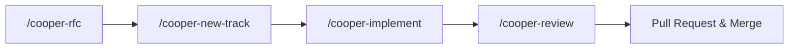

# Cooper Workflow & Lifecycle

The Cooper framework establishes a repeatable lifecycle for engineering changes, moving from collaborative architecture proposals down to isolated, test-driven implementations.

## 1. Architectural Initiative (`/cooper-rfc`)
When a proposed change may introduce large architecture modifications or affects multiple codeowners, start with an RFC:
- Draft an architectural RFC in `.cooper/active/rfc-<name>/rfc.md`.
- Open a **Draft Pull Request** early to gather stakeholder and peer feedback.
- Once approved, run `/cooper-new-track` to break down work into focused tracks.

See [Draft PRs in the Cooper RFC Lifecycle](../rfc-draft-prs.md) for details.

## 2. Track Planning (`/cooper-new-track`)
For single-capability features, bug fixes:
- Spawn an isolated [Troop](https://twoboots.github.io/troop) worktree via `git agent-start <track_id>`.
- Generate the **Proposal** (`proposal.md`), **Technical Design** (`design.md`), and **Spec Delta** (`spec-deltas/<capability>/spec.md`).
- Formulate a TDD-enforced implementation plan (`plan.md`) with explicit phases and checkpoints.
- Register the track in `.cooper/tracks.md`.

## 3. Implementation & TDD Loop (`/cooper-implement`)
Work strictly inside the dedicated [Troop](https://twoboots.github.io/troop) worktree (`.worktrees/<track_id>`):
- **Task Selection**: Mark the next task in-progress (`[~]`) and commit the status change.
- **Red Phase**: Write targeted tests validating the Spec Delta requirements and ensure test failure.
- **Green Phase**: Write the minimum necessary production code to achieve test success.
- **Refactor Phase**: Optimize, clean code, and verify >80% test coverage.
- **Git Notes**: Record task summary metadata (`git notes add -m`) against the task commit to preserve implementation context against drift.
- **Phase Verification Checkpoint**:
  - Run `git fetch origin main` to synchronize workflow rules and living specs.
  - Run the full automated test suite.
  - Complete manual verification.
  - Create a checkpoint commit and push (`git push origin <track_id>`).

## 4. Quality Review (`/cooper-review`)
Before opening or merging a PR, act as a principal engineer to:
- Audit all changed files against the track's Spec Deltas.
- Confirm 100% adherence to project code styleguides and test coverage criteria.
- Archive the track into `.cooper/archive/<track_id>/` upon completion.
- Tear down the worktree cleanly using `git agent-stop <track_id>` after human approval and pull request merge.
