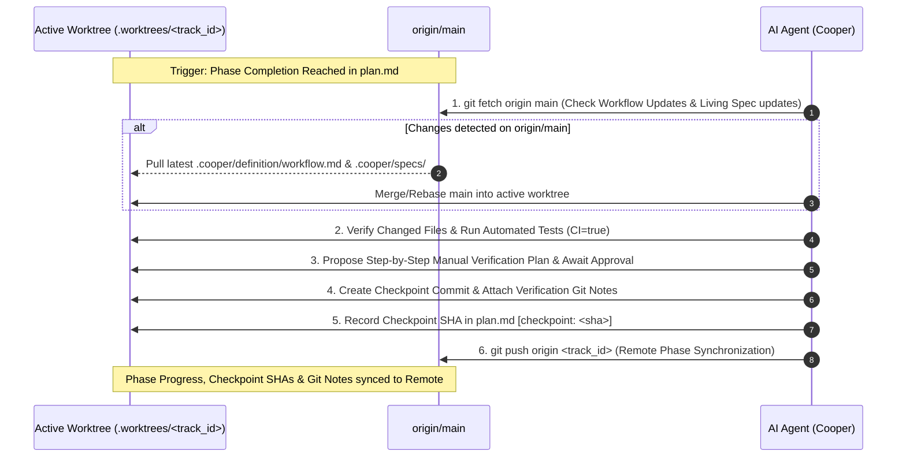
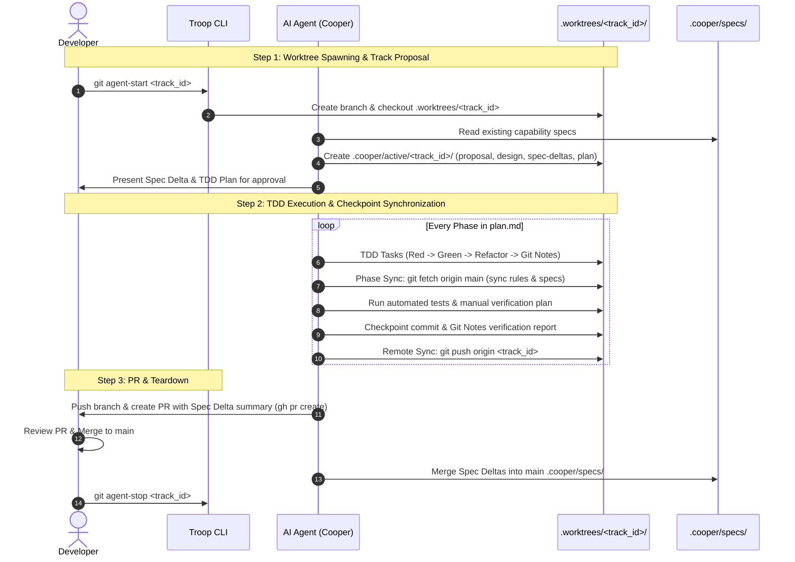

# OpenSpec vs. Conductor Comparison & Cooper Hybrid Architecture Blueprint

## Executive Summary

As AI coding agents (Claude Code, Cursor, Gemini CLI, Antigravity, etc.) mature, software development is shifting from informal "vibe coding" (ad-hoc prompt-and-pray iterations) toward **Spec-Driven Development (SDD)**. SDD establishes explicit, human-reviewable specifications and step-by-step implementation plans before an AI agent writes application code.

**Cooper** integrates the **Conductor** spec-driven framework with **[Troop](https://github.com/twoBoots/troop)** Git worktree isolation (`.worktrees/`). This document outlines how the **Cooper Hybrid Framework** (`.cooper/`) incorporates **OpenSpec's Living Spec Deltas** while fully respecting Cooper's TDD, quality gates, phase synchronization protocols, and Troop worktree isolation.

---

## 1. Core Framework Comparison

| Dimension | Customized Conductor Approach | OpenSpec (Fission AI) | Cooper Hybrid Model (`.cooper/` + [Troop](https://github.com/twoBoots/troop)) |
| :--- | :--- | :--- | :--- |
| **Primary Focus** | Agent Orchestration & Governance | Domain Capability Specs & Spec Deltas | **Unified Spec-Driven Orchestration with Worktree Isolation** |
| **Root Directory** | `conductor/` | `openspec/` | **`.cooper/`** |
| **Isolation Mechanics** | Single workspace branch | Single workspace branch | **[Troop](https://github.com/twoBoots/troop) Worktrees (`.worktrees/<track_id>/`)** |
| **Core Unit** | **Track** (`conductor/tracks/<id>/`) | **Capability & Change** (`openspec/specs/` & `changes/`) | **Living Specs + Active Worktree Tracks** (`.cooper/specs/` & `.cooper/active/`) |
| **Knowledge Representation** | Append-Only Track History | Living Capability Library + Spec Deltas | **Living Capability Library + Spec Deltas** |
| **Execution Control** | Strict TDD, style guides, checkpoints | Flexible / Agnostic | **Strict TDD, style guides, Git Notes & phase checkpoints** |
| **Phase Synchronization** | Manual / Local | N/A | **Automatic (`git fetch origin main` & `git push origin <track_id>`)** |
| **Agent Skills** | External Global Plugin Prerequisite | N/A | **Packaged Project-Local Skills (`.agents/skills/`)** |
| **Scaffolding** | Full (`product.md`, `tech-stack.md`) | Minimalist | **Full Scaffolding (`.cooper/definition/`)** |

---

## 2. The Cooper Hybrid Architecture (`.cooper/` & `.agents/skills/`)

```
your-project/
├── .agents/
│   └── skills/                        # Packaged Project-Local Cooper Skills
│       ├── cooper-setup/SKILL.md      # Project initialization & scaffolding
│       ├── cooper-new-track/SKILL.md  # Worktree spawning & spec delta planning
│       ├── cooper-implement/SKILL.md  # TDD execution & phase sync
│       ├── cooper-review/SKILL.md     # Code & spec delta review
│       └── cooper-status/SKILL.md     # Worktrees & track overview
├── .cooper/
│   ├── index.md                       # Handshake index (Single Source of Truth)
│   ├── COOPER.md                      # Cooper SDD reference manual & cheatsheet
│   ├── TROOP.md                       # Troop worktree reference manual
│   ├── tracks.md                      # Tracks Registry
│   ├── definition/                    # Global project definitions
│   │   ├── product.md                 # Product vision & initial concepts
│   │   ├── product-guidelines.md      # UX, branding, prose standards
│   │   ├── tech-stack.md              # Languages, frameworks, DBs
│   │   └── workflow.md                # Coverage (>80%), TDD rules, commit frequency & Troop protocol
│   ├── code_styleguides/              # Language-specific conventions (python.md, typescript.md)
│   ├── specs/                         # LIVING CAPABILITY SPECS (OpenSpec Living Spec model)
│   │   ├── auth-login/spec.md
│   │   ├── auth-session/spec.md
│   │   └── checkout-cart/spec.md
│   ├── active/                        # ACTIVE TRACKS (Living inside .worktrees/<track_id>/)
│   │   └── track_add_remember_me_20260813/
│   │       ├── proposal.md            # High-level rationale & decisions
│   │       ├── design.md              # Technical architecture decisions
│   │       ├── plan.md                # TDD-enforced, phase-checkpointed plan
│   │       ├── metadata.json          # Track metadata & status
│   │       └── spec-deltas/           # Requirement diffs (+ added, - removed)
│   │           └── auth-session/spec.md
│   └── archive/                       # HISTORICAL COMPLETED TRACKS
│       └── track_initial_setup_20260801/
├── .worktrees/                        # Isolated Git worktrees for active tracks
└── AGENTS.md                          # Universal agent guidelines
```

---

## 3. How the Cooper Workflow & [Troop](https://github.com/twoBoots/troop) Are Respected

### 3.1 [Troop](https://github.com/twoBoots/troop) Worktree Isolation (`git agent-start` / `git agent-stop`)
* **Worktree Spawning (`git agent-start <track_id>`)**:
  When a new track is initiated, Troop spawns an isolated Git worktree under `.worktrees/<track_id>`. All feature code, test additions, and track-specific `.cooper/active/<track_id>/` files are created inside that isolated worktree.
* **Parallel Execution**:
  Multiple agents or human developers can work on separate tracks concurrently in distinct worktrees without branch switching or uncommitted state conflicts (`git troop` lists all active worktrees).
* **Teardown (`git agent-stop <track_id>`)**:
  Once the track's PR is merged and its Spec Deltas are integrated into main's `.cooper/specs/`, Troop cleans up `.worktrees/<track_id>` and deletes the local track branch.

### 3.2 Strict TDD Red/Green/Refactor Protocol
Each task in `.cooper/active/<track_id>/plan.md` follows Cooper's strict TDD lifecycle:
1. **Mark In Progress**: Task status changes from `[ ]` to `[~]`.
2. **Red Phase**: Write failing unit tests first. Run test suite to verify failure.
3. **Green Phase**: Write minimum application code to pass tests.
4. **Refactor**: Clean up implementation and test code.
5. **Coverage & Quality Gates**: Verify >80% code coverage, zero linter errors, docstrings, and type safety.
6. **Task Summary Git Notes**: Attach commit summary metadata via `git notes add -m "<summary>" <commit_hash>`.
7. **Mark Done**: Update `plan.md` to `[x]` with short commit SHA.

---

## 4. Cooper Phase Completion & Synchronization Protocols

Phase completion in Cooper is not a silent step; it enforces **three levels of synchronization** alongside automated and manual verification:



### 4.1 Workflow Rule Synchronization (`git fetch origin main`)
* At phase completion, Cooper executes `git fetch origin main`.
* It checks if `.cooper/definition/workflow.md` (or style guides) on `origin/main` has been updated by other tracks/branches.
* If changes exist, Cooper prompts the developer to merge or rebase `origin/main` into `.worktrees/<track_id>` so subsequent phases follow the latest project rules.

### 4.2 Living Spec Synchronization *(Hybrid Enhancement)*
* During the `git fetch origin main` check, Cooper checks for updates to `.cooper/specs/` on `origin/main`.
* If a parallel track in another worktree merged into `main` and updated a living spec (e.g., `.cooper/specs/auth-session/spec.md`), Cooper pulls those spec updates into `.worktrees/<track_id>`.
* This prevents **spec collisions** between parallel worktrees operating in the same codebase.

### 4.3 Remote Progress & Checkpoint Synchronization (`git push origin <track_id>`)
* Upon completing phase verification and creating the checkpoint commit (`cooper(checkpoint): Checkpoint end of Phase X`), Cooper attaches an auditable verification report using `git notes`.
* It updates `plan.md` with `[checkpoint: <sha>]` and immediately executes `git push origin <track_id>`.
* Remote team members, project status dashboards, and CI pipelines obtain real-time visibility into exact phase completion states.

---

## 5. End-to-End Hybrid Lifecycle Sequence



---

## 6. Artifact Specs & Examples in `.cooper/`

### 6.1 Spec Delta (`.cooper/active/<track_id>/spec-deltas/auth-session/spec.md`)
```diff
### Requirement: Session expiration
- The system SHALL expire sessions after 24 hours of inactivity.
+ The system SHALL support configurable session expiration based on user preference.

#### Scenario: Default session timeout
- GIVEN a user has authenticated
- WHEN 24 hours pass without activity
- THEN invalidate the session token

+ #### Scenario: Persistent session with Remember Me
+ GIVEN a user authenticated with "Remember me" checked
+ WHEN 30 days elapse without manual logout
+ THEN maintain active session token
+ AND clear persistent cookie upon explicit logout
```

### 6.2 TDD-Enforced Task Plan (`.cooper/active/<track_id>/plan.md`)
```markdown
# Implementation Plan: Add Remember Me Sessions

## Phase 1: Core Session Token Logic
- [ ] Task: Database Schema & Migration for Persistent Tokens
  - [ ] Sub-task: Write Migration Tests (`tests/db/session_migration_test.py`)
  - [ ] Sub-task: Create Migration Script (`migrations/004_remember_me.sql`)
- [ ] Task: Session Expiration Handler
  - [ ] Sub-task: Write Unit Test for 30-day token validation (`tests/auth/test_session.py`)
  - [ ] Sub-task: Implement 30-day token validation logic (`src/auth/session.py`)
- [ ] Task: Cooper - User Manual Verification 'Phase 1: Core Session Logic'

## Phase 2: UI Checkbox & Auth Integration
- [ ] Task: Login Form Checkbox Component
  - [ ] Sub-task: Write UI Component Test (`tests/ui/login_test.tsx`)
  - [ ] Sub-task: Implement "Remember Me" checkbox (`src/components/LoginForm.tsx`)
- [ ] Task: Cooper - User Manual Verification 'Phase 2: UI & Auth Integration'
```

---

## 7. Summary of Cooper + [Troop](https://github.com/twoBoots/troop) Benefits

1. **Total Workspace Isolation**: Troop ensures agents operate in clean, isolated `.worktrees/<track_id>` directories without touching main worktree state.
2. **Robust Phase Synchronization**: Ensures workflow rules, living specs, and phase progress remain synchronized across parallel worktrees and remote repositories.
3. **Strict Quality Governance**: Preserves Cooper's TDD, coverage checks (>80%), style guides, Git Notes summaries, and phase checkpoint protocols.
4. **Persistent System Knowledge**: OpenSpec's living capability specs (`.cooper/specs/`) ensure system specifications never decay or get lost in archived tracks.
