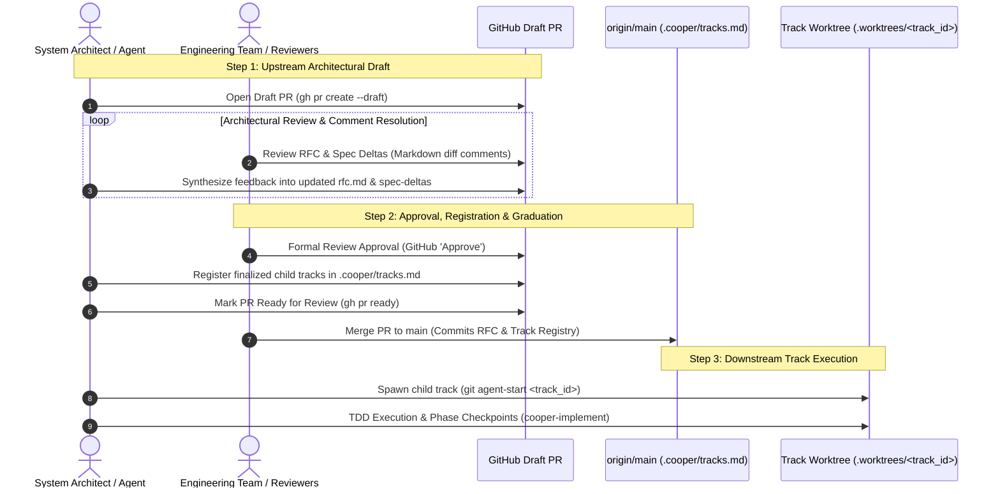

# Why Cooper Architectural RFCs Use Draft Pull Requests

## Executive Summary

In the **Cooper Spec-Driven Development (SDD)** framework, software initiatives are governed by a **Two-Tier Architecture Model**:

1. **Upstream Alignment (`cooper-rfc`)**: High-level problem validation, architectural trade-offs, cross-capability living spec deltas (`spec-deltas/`), and team consensus.
2. **Downstream Execution (`cooper-new-track` & `cooper-implement`)**: Isolated Troop worktrees (`.worktrees/<track_id>`), strict Test-Driven Development (Red -> Green -> Refactor), code coverage >80%, and Phase Checkpoint synchronization.

A foundational rule of the upstream tier is that **all architectural RFCs are opened as GitHub/GitLab Draft Pull Requests** (`gh pr create --draft`).

This document details the governance rationale, comparative advantages, and lifecycle mechanics of why Cooper mandates Draft PRs for architectural design initiatives.

---

## 1. Rationale & Comparison: Draft RFC PR vs. Regular PR

| Dimension | Draft RFC PR | Regular PR |
| :--- | :--- | :--- |
| **GitHub Merge State** | 🚫 **Merge blocked** by GitHub. Cannot be accidentally merged prematurely. | ✅ Mergeable at any time by maintainers or automated merge rules. |
| **Intended Signal** | *"This architecture is under discussion and actively seeking feedback."* | *"This work is finished and ready to be committed to `main`."* |
| **Living Spec & Track Integrity** | Spec deltas and track breakdowns iterate dynamically on the branch until team consensus is solid. | If merged prematurely, stale or unaligned tracks and spec deltas pollute `main`. |
| **CI / Notification Noise** | Bypasses heavy code CI/CD pipelines (e.g., container builds, end-to-end suites, preview deploys) while retaining Markdown review. | Triggers full CI/CD test suites and aggressive reviewer assignment policies. |
| **Graduation Trigger** | Mark `Ready for review` (`gh pr ready`) + register child tracks **only after** team approves the design. | Track registration has to happen upfront before consensus is reached. |

---

## 2. The 3 Primary Benefits of a Draft RFC PR

### 1. Prevents Premature Commit of Unapproved Specs & Tracks

In Cooper SDD, `.cooper/tracks.md` on `main` is the **authoritative master registry** of approved and completed work.

During RFC review, reviewers and architects frequently refine the implementation strategy:
> *"We shouldn't build Track 3 yet, and Track 1 should be split into two separate tracks to reduce delivery risk."*

If an RFC were opened as a regular PR and merged early:
* `.cooper/tracks.md` on `main` would become polluted with invalid, discarded, or misaligned track IDs.
* Living capability specifications (`.cooper/specs/`) on `main` would reflect unapproved or rejected behavioral requirements.

Keeping the RFC in **Draft** state ensures that the track breakdown and living spec deltas can adapt dynamically on the branch until full team consensus is achieved.

---

### 2. Safe Collaborative Review Surface

Draft Pull Requests provide a rich, interactive collaboration environment without the risk of accidental merging:

* **Rendered Markdown & Architecture Diagrams**: Mermaid flowcharts and sequence diagrams render natively in the GitHub/GitLab PR UI.
* **Inline Line-by-Line Diffs**: Reviewers can comment directly on specific `GIVEN` / `WHEN` / `THEN` scenarios within `spec-deltas/<capability>/spec.md`.
* **Threaded Technical Discussions**: Architectural debates, trade-offs, and open questions are resolved directly in PR discussion threads.
* **Explicit Visual Banner**: GitHub displays an unmistakable visual banner signaling to maintainers that the PR is an **RFC in review**, not production code awaiting merge.

---

### 3. Clean Two-Step Milestone Gate

Draft PRs enforce an explicit, two-step quality and consensus milestone gate:



---

## 3. The RFC Graduation Lifecycle

The complete lifecycle from architectural conception to code execution follows six structured stages:

```
[1. Draft RFC & Spec Deltas]
         │ (cooper-rfc)
         ▼
[2. Open Draft PR] ──► gh pr create --draft
         │
         ▼
[3. Collaborative Discussion & Iteration] ──► Inline diff reviews on spec-deltas/
         │
         ▼
[4. Team Approval Received] ──► GitHub 'Approve' / maintainer sign-off
         │
         ▼
[5. Finalize Tracks & Mark Ready] ──► Auto-register tracks in .cooper/tracks.md + gh pr ready
         │
         ▼
[6. Maintainer Merges to main] ──► Downstream tracks unlocked for cooper-new-track & cooper-implement
```

1. **RFC Scoping & Spawning (`cooper-rfc`)**: The architect or AI agent creates an isolated RFC workspace (`.worktrees/rfc-<name>`) and drafts `rfc.md`, cross-capability `spec-deltas/`, and `tracks-breakdown.md`.
2. **Draft PR Submission (`gh pr create --draft`)**: The RFC branch is pushed, and a Draft PR is opened with the `rfc` label.
3. **Collaborative Review & Feedback Synthesis**: The team reviews the design, and the agent synthesizes PR comments into revised RFC documents and living spec diffs.
4. **Team Approval**: Once consensus is achieved and all open questions are resolved, reviewers approve the PR.
5. **Track Registration & Graduation**: The finalized child tracks are appended to `.cooper/tracks.md`, and the PR is marked ready (`gh pr ready`).
6. **Merge to `main` & Track Execution**: A maintainer merges the PR into `main`. Downstream developers and agents can now pick up individual child tracks in their own isolated worktrees using `cooper-new-track` and `cooper-implement`.

---

## 4. Frequently Asked Questions

### What happens if an RFC is rejected or superseded?
Because the RFC is in a Draft PR on an isolated branch, closing the PR cleanly abandons the proposal without requiring any Git reverts on `main`. Trunk's `.cooper/tracks.md` and `.cooper/specs/` remain completely untouched.

### What if child track scopes change during review?
Child tracks are only registered in `.cooper/tracks.md` *after* team approval is granted in Step 5. Prior to that, tracks in `tracks-breakdown.md` can be split, merged, reordered, or deleted freely without polluting the master track registry.
